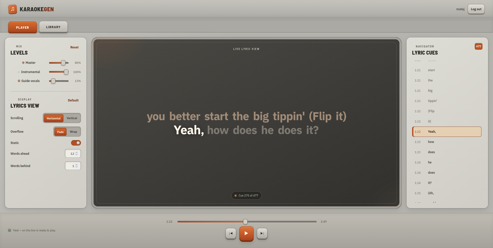
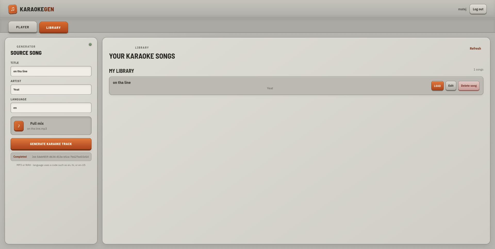
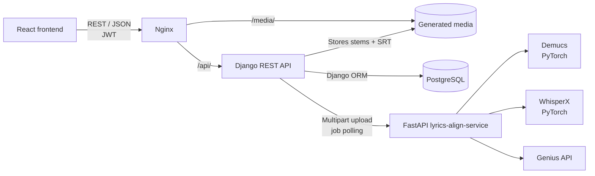

# AI Karaoke Generator

A full-stack portfolio project that turns a regular song into a playable karaoke track.

You upload a full-mix recording. The application separates it into instrumental and vocal stems, transcribes and aligns the lyrics word by word, and loads the result into a browser player with synchronized lyrics and independent volume controls.

The project demonstrates Python backend development and serving machine learning models in a web application. It covers object-oriented design in a PyTorch inference pipeline, a FastAPI model-serving service, a Django REST API, a React frontend, and deployment of the full stack with Docker Compose.


## Screenshots

### Player

Synchronized word-level lyrics, a cue navigator, and a mixer for the master, instrumental, and guide-vocal levels.



### Library

Generate a karaoke track from a full mix, then load, edit, or delete songs in your library.



## Overview

An authenticated user can:

- Upload an MP3 or WAV full mix with its title, artist, and language
- Follow the progress of the generation job
- Play the instrumental with optional guide vocals and adjust each level separately
- Follow word-by-word lyrics with horizontal or vertical scrolling, fade or wrap overflow, and a configurable number of words shown ahead and behind
- Jump to any lyric cue from the navigator
- Keep generated songs in a personal library and edit or delete them

Under the hood, generation runs as an asynchronous job:

1. **Demucs** (`htdemucs`) separates the recording into `vocals` and `no_vocals` stems.
2. **WhisperX** transcribes the isolated vocals.
3. If **Genius** has lyrics for the song, they are cleaned and matched against the transcription to fix recognition errors.
4. WhisperX aligns the corrected text to the audio at word level.
5. The alignment is exported as an SRT file with one cue per word.

## Architecture



The repository contains three services:

| Service | Responsibility |
| --- | --- |
| `lyrics-align-service` | FastAPI service that runs the ML pipeline and exposes jobs and generated artifacts |
| `karaoke-gen-service` | Django REST API for users, songs, libraries, playlists, and generation jobs |
| `karaoke-gen-frontend` | React single-page app with the player and the library |

The browser only talks to Django. Django accepts the upload, returns `202 Accepted` with a job ID, and forwards the audio to the alignment service in the background. It polls the alignment service, downloads the SRT, instrumental, and vocal files, stores them as song assets, and adds the song to the user's library. The frontend polls Django for the job status and loads the finished song into the player.

## Machine learning pipeline highlights

The `lyrics-align-service` is organized around object-oriented design patterns, so the ML code stays testable and each part can be replaced independently.

### Adapter

Each third-party library is wrapped in an adapter that converts its output into the project's own domain objects:

- `DemucsAdapter` runs Demucs and returns a `SourceSeparationResult`
- `WhisperXAdapter` loads WhisperX models, then transcribes and aligns vocals into a `Transcription`
- `GeniusLyricsAdapter` wraps the `lyricsgenius` client and returns `ReferenceLyrics`

The rest of the pipeline never touches raw Demucs, WhisperX, or Genius data.

### Strategy

- `LyricsExportStrategy` is an abstract base class with `SRTExportStrategy` and `JsonExportStrategy` implementations. `LyricsExportService` picks one explicitly or infers it from the file extension.
- `LyricsNormalizationStrategy` defines how Genius lyrics are cleaned; for example, `RemoveBracketedAnnotationsStrategy` removes section headers such as `[Chorus]`. `GeniusLyricsNormalizer` applies a configurable chain of strategies.

New export formats or cleaning rules are added as new classes, without changing existing code.

### Pipeline as a facade

`Pipeline` coordinates separation, transcription, lyric lookup, correction, alignment, and export behind a single `forward()` method. It also manages model lifetimes: WhisperX is loaded only after Demucs has finished, the transcription model is released before alignment, and CUDA memory is freed after every job, so the models never share GPU memory.

### Immutable domain model

`Transcription`, `TranscriptSegment`, `WordSegment`, `Lyrics`, `SongMetadata`, `LyricsCorrectionResult`, and `PipelineResult` are frozen dataclasses. Each pipeline stage returns new objects instead of changing shared state, which makes the stages easier to follow and to test.

### Lyrics correction

`LyricsCorrector` matches the reference lyrics to the WhisperX segments in the order they are performed, using dynamic programming. It scores each candidate span by text similarity, segment duration, and line boundaries, and it can keep or drop ad-libs. Every correction is recorded in the result.

### Serving the models with FastAPI

- `POST /jobs` accepts a multipart upload and returns `202 Accepted` right away
- The pipeline runs in a worker thread (`asyncio.to_thread`), so the event loop stays responsive
- An `asyncio.Semaphore` allows one pipeline at a time to keep GPU memory bounded
- The job status, SRT, instrumental, and vocals are available from separate endpoints
- WhisperX uses `float16` on CUDA and falls back to `int8` on CPU

## Backend highlights

- Django REST Framework viewsets for songs, playlists, and libraries
- JWT authentication with registration, login, and token refresh (`djangorestframework-simplejwt`)
- Object-level permissions: users see public songs and their own private songs, only the uploader can edit or delete a song, and staff have wider access
- A `SongProcessingJob` model that tracks each generation from queued to completed or failed
- `LyricsAlignClient`, a dedicated HTTP client for the alignment service with request, polling, and job timeouts
- Background import that saves the generated files, marks the song complete, and adds it to the user's library
- OpenAPI schema with Swagger UI and ReDoc (`drf-spectacular`)
- Configuration through environment variables, with PostgreSQL in Docker and SQLite for local development
- 45 Django tests run by GitHub Actions on every change

## Frontend highlights

- React 19 app with separate Player and Library views
- Two audio elements, instrumental and vocals, kept in sync, each with its own volume
- SRT parsing and word-level lyric highlighting that follows the current cue
- Lyric display settings: scrolling direction, overflow mode, a static mode, and the number of words shown ahead and behind
- Upload form with job polling every two seconds
- Session restore and automatic access-token refresh
- 31 tests with React Testing Library

## Technology stack

| Area | Technologies |
| --- | --- |
| Machine learning | PyTorch 2.8, torchaudio, Demucs, WhisperX (faster-whisper / CTranslate2), librosa, pyloudnorm |
| Lyrics source | Genius API (`lyricsgenius`) |
| Model serving | FastAPI, Uvicorn, Pydantic |
| Backend | Python 3.12, Django 5.2, Django REST Framework, SimpleJWT, drf-spectacular |
| Persistence | PostgreSQL 17 (Docker), SQLite (local development) |
| Frontend | React 19, JavaScript, CSS |
| Web server | Nginx for the React build, API proxy, and media files |
| Infrastructure | Docker, Docker Compose, NVIDIA Container Toolkit (optional GPU), Gunicorn |
| Testing and CI | Django test runner, Jest, React Testing Library, GitHub Actions |

## API endpoints

### Django REST API

All endpoints except registration, login, and token refresh require a `Bearer` access token.

| Method | Endpoint | Description |
| --- | --- | --- |
| `POST` | `/api/auth/register/` | Create an account and receive tokens |
| `POST` | `/api/auth/login/` | Get an access and refresh token pair |
| `POST` | `/api/auth/token/refresh/` | Refresh the access token |
| `GET` | `/api/songs/` | List the songs you can see |
| `POST` | `/api/songs/` | Upload a full mix and start generation (`202 Accepted`) |
| `GET` | `/api/songs/processing-status/{job_id}/` | Check a generation job |
| `GET` `PATCH` `DELETE` | `/api/songs/{id}/` | Read, update, or delete a song |
| `GET` | `/api/libraries/` | List your libraries |
| `POST` | `/api/libraries/{id}/add-song/` | Add a song to a library |
| `GET` `POST` | `/api/playlists/` | List or create playlists |
| `GET` | `/api/docs/` | Swagger UI |

### Lyrics alignment service

| Method | Endpoint | Description |
| --- | --- | --- |
| `GET` | `/health` | Check that the service is running |
| `POST` | `/jobs` | Submit title, artist, language, and audio (`202 Accepted`) |
| `GET` | `/jobs/{job_id}` | Get the job status and download links |
| `GET` | `/jobs/{job_id}/download/srt` | Download the aligned lyrics |
| `GET` | `/jobs/{job_id}/download/instrumental` | Download the instrumental stem |
| `GET` | `/jobs/{job_id}/download/vocals` | Download the vocal stem |

## Running with Docker

### Prerequisites

- Git
- Docker with Docker Compose
- A [Genius API](https://genius.com/api-clients) access token
- Optional: an NVIDIA GPU with the NVIDIA Container Toolkit

### 1. Clone the repository

```bash
git clone https://github.com/matejmagat/ai-karaoke-generator.git
cd ai-karaoke-generator
```

### 2. Create the environment file

```bash
cp .env.docker.example .env
```

Set at least these values in `.env`:

```dotenv
GENIUS_ACCESS_TOKEN=your-genius-token
DJANGO_SECRET_KEY=a-long-random-secret
POSTGRES_PASSWORD=change-me
```

Generate a secret key with:

```bash
python -c "import secrets; print(secrets.token_urlsafe(50))"
```

### 3. Start the application

On CPU:

```bash
docker compose up --build
```

With an NVIDIA GPU:

```bash
docker compose -f compose.yaml -f compose.gpu.yaml up --build
```

Open the application at:

```text
http://localhost:8080
```

Register an account, go to **Library**, and generate your first track. The first generation also downloads the model weights into a Docker volume, so it takes longer than later ones.

To create an admin user:

```bash
docker compose exec karaoke-gen-service python manage.py createsuperuser
```

### 4. Stop the application

```bash
docker compose down
```

To also remove the database, generated media, and downloaded models:

```bash
docker compose down -v
```

See [docs/DOCKER.md](docs/DOCKER.md) for the container layout, volumes, and every configuration option.

## Local development

Each service can also run directly on the host. Details are in [docs/INTEGRATION.md](docs/INTEGRATION.md).

### Lyrics alignment service (port 8001)

```bash
cd lyrics-align-service
python -m venv .venv
source .venv/bin/activate
pip install -r requirements.txt        # requirements-dev.txt adds Jupyter
cp .env.example .env                   # set GENIUS_ACCESS_TOKEN
uvicorn src.api.main:app --host 127.0.0.1 --port 8001 --reload
```

For GPU inference, install the CUDA build of PyTorch before the other requirements.

### Django API (port 8000)

```bash
cd karaoke-gen-service
python -m venv .venv
source .venv/bin/activate
pip install -r requirements.txt
python manage.py migrate
LYRICS_ALIGN_SERVICE_URL=http://localhost:8001 python manage.py runserver 8000
```

### React frontend (port 3000)

```bash
cd karaoke-gen-frontend
cp .env.example .env                   # REACT_APP_API_BASE_URL=http://localhost:8000
npm install
npm start
```

Open:

```text
http://localhost:3000
```

## Testing

### Backend

```bash
cd karaoke-gen-service
python manage.py test
```

The tests cover registration and authentication, song permissions, the generation workflow with a mocked alignment service, libraries, and playlists.

### Frontend

```bash
cd karaoke-gen-frontend
npm test -- --watchAll=false
```

The tests cover the API client, the player, the lyrics display and its settings, and the library.

### Continuous integration

GitHub Actions runs the Django tests and a Docker workflow. The Docker workflow builds all three images, checks that the ML dependencies import, and runs a smoke test of the stack through nginx.

## Repository structure

```text
.
├── docs/
│   ├── DOCKER.md
│   ├── INTEGRATION.md
│   └── images/
├── lyrics-align-service/
│   ├── src/
│   │   ├── adapters/          # Demucs, WhisperX, Genius adapters
│   │   ├── api/               # FastAPI app, job store, schemas
│   │   ├── domain/            # Frozen dataclasses
│   │   │   ├── export/        # Export strategies (SRT, JSON)
│   │   │   └── normalization/ # Lyrics normalization strategies
│   │   ├── pipeline/          # Pipeline facade
│   │   └── services/          # Corrector, normalizer, export service
│   ├── testing/               # Experiment notebooks
│   ├── Dockerfile
│   └── requirements.txt
├── karaoke-gen-service/
│   ├── catalog/               # Songs, processing jobs, alignment client
│   ├── library/               # Libraries and playlists
│   ├── users/                 # Custom user model and registration
│   ├── config/                # Settings and URLs
│   ├── Dockerfile
│   └── requirements.txt
├── karaoke-gen-frontend/
│   ├── src/
│   ├── Dockerfile
│   └── nginx.conf.template
├── .github/workflows/
├── compose.yaml
├── compose.gpu.yaml
└── README.md
```

## Engineering decisions

### Separate ML service

The GPU-heavy pipeline runs in its own FastAPI service rather than inside Django. The web API stays lightweight and responsive, and the ML service can be scaled, restarted, or moved to a GPU machine on its own. The two services communicate only over HTTP.

### Asynchronous jobs

Separating and aligning a song takes minutes, so neither service keeps the upload request open. Both return `202 Accepted` with a job ID, and clients poll for the status. This avoids HTTP timeouts and lets the UI show progress.

### Adapters around ML libraries

Demucs, WhisperX, and Genius are wrapped in adapters that return the project's own domain objects. The correction and export logic therefore does not depend on third-party data formats, can be tested without loading models, and would survive a model being replaced.

### GPU memory management

Demucs and WhisperX are never loaded at the same time, the pipeline runs one job at a time, and CUDA memory is freed after each stage. This lets the full pipeline run on a single consumer GPU.

### Reference lyrics with a transcription fallback

Speech recognition often mishears sung lyrics. When Genius has the lyrics, they are used to correct the transcription before alignment. When it does not, the pipeline still finishes using the WhisperX transcription alone.

### Artifacts stored separately

The instrumental, vocals, and SRT are kept as separate files. Django stores each one as a song asset, and the frontend loads them independently, which is what makes the separate volume controls possible.

### Same-origin deployment

In Docker, nginx serves the React build and routes `/api/` and `/media/` from one origin. The browser never needs CORS, and only a single port is exposed on the host.

## Project scope

This repository is a personal portfolio and learning project rather than a production deployment.

Jobs are tracked in memory by both services, so jobs still in progress are lost if a container restarts. Tokens are kept in browser local storage for convenience.

A production version would need a persistent task queue such as Celery or RQ with Redis, HttpOnly refresh-token cookies, TLS, object storage for media, and monitoring.

## Author

**Matej Magat**

- GitHub: [@matejmagat](https://github.com/matejmagat)
- LinkedIn: [matej-magat](https://www.linkedin.com/in/matej-magat/)
